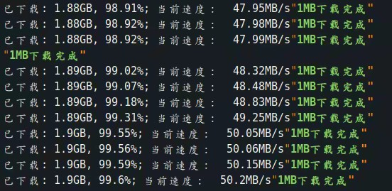

# 设计思路-客户端部分
 
> 之前尝试过 electron 写界面, 不过他打出来的包太大了, 
而且和go需要用websocket通信, 这样所有页面对go的调用都是异步的, 写起来不太爽.
偶然发现qml这个东西, 发现很适合做界面, 也是JavaScript语法, 而且没有electron的这些缺陷. 
所以最后决定用go + qml开发. go 处理所有业务逻辑, qml负责显示逻辑.

## ui, 逻辑分离
> 为了保持项目的整洁性, 不希望go的逻辑强耦合于qml, 所以决定qml对于go的调用都通过rpc的方式来实现.
这样做带来的好处是, 可以方便的更换ui侧技术栈. 比如说不用qml而是用qt widget来渲染界面;
 甚至可以用系统原生接口来展示界面.

### 实现rpc
rpc是什么? 就是一方需要调用不在同一个代码执行环境的另一方的函数, 并得到返回值. 
既然不在同一执行环境, 那么函数的参数和返回值就不能直接通过内存来传递. 而是需要通过某种跨执行环境的方式将参数传递过去,
在常见的场景下面都是通过网络来传递, 比如大型项目常用的微服务架构通过http或者消息队列传递数据实现rpc.
但是我们这里并不打算通过网络来实现, 刚说过了通过网络只能走异步调用, 因为js是单线程的, 不能在网络io这阻塞, 
否则界面会卡顿.

实现rpc 就要实现qml和go之间的通信. 通过查阅qt文档和资料, 我发现qml支持原声组件. 什么是原生组件? 通常的组件表现是由符合qml语法结构类json代码实现的, 
并通过js来改变组件属性来控制界面变化. 而原生组件是由c++类来实现, 通过c++代码来画出需要渲染的外观并处理相应的事件.
原生组件可以导入到qml文件供非原生组件使用, 并且qml可以调用原生组件的方法. 这样就实现了qml 和c++之间的数据传递.
由于go是支持和c混编的, 所以我们可以通过c++中间代码, 来让qml的调用都通过c++转到go来, 让go来处理真正的逻辑.
听起来很麻烦? 别担心, 已经有优秀的第三方包来实现自动生成c++中间代码. 所以我们只管用的结构体代替c++的类. 开发中完全不需要进行c++编程.
所以你可以不会c++.

qml到go的通信问题解决了. 为了减少耦合, 我们只用go实现一个原生组件, 并把这个原生组件引入到qml.
这里你需要了解2个概念: slot 和 signal. 你可以百度搜索<qt slot signal>关键字, 了解是什么就可以啦.
slot 可以让一个组件调用另外一个组件的方法并获取返回值. signal让A组件可以发送事件(数据)给B组件, 而且不只有B组件可以监听这个事件, 其他组件也可以监听.
我们定义一个在原生组件中定义一个 goMessage signal, 并在qml中监听这个信号, 这样go随时可以通过goMessage来发送消息给qml, 比如下载任务的进度, 速度等信息.
然后再定义一个 callGoAsync signal, 来实现qml异步调用go: qml组件将需要调用的函数名称, 参数, 以及本次调用的唯一id,通过json序列化之后触发callGoAsync信号.
原生组件收到这个信号, 开启一个协程解析出调用函数名和参数, 然后调用真正的go实现, 得到结果之后在触发goMessage把结果和调用id发到qml, 
qml里通过调用id的找到异步调用发起的回调函数, 把结果通过回调函数发给调用者.

## 并发下载
对于非会员, 百度是有速度的限制的. 一开始我以为和视频网站的vip专供视频一样, 百度的不限速下载地址也可以通过调用接口时改变参数来得到.
但是经过我的分析发现, 会员和非会员都是调用相同的接口,传的相同的参数. 百度服务端根据你是否是会员来决定返回是否限速的链接,
所以非会员没有办法获取不限速链接. 不过幸运的是, 所谓的限速是针对一个http连接的. 如果你向下载这个地址同时发起2个http请求, 
你会发现他们速度限制是分离的,单个连接的速度不会因为连接数的增多而降低. 
所以我们可以通过同时发起多个http请求来提高总的下载速度, 比如同时发起100个请求, 那么理论上你能获得大于限制速度100倍的最大速度.
当然并发请求当然是不能一样的, 不然100个请求下载下来的内容都是一样的, 这样没有意义. 所以我们应该把整个下载任务进行分段, 
每个请求通过改变http的range头部负责一段不同的下载, 然后通过fseek把下载的内容写入到本地文件的不同位置.
那么问题来了, 并发连接数是不是越大越好呢? 不是的, 当百度检测到你的并发很高会直接拒绝你的请求, 甚至有可能对你的账号拉入黑名单.
经过我的测试, 通过调节并发数, 非会员最大速度最大一般可以达到6~8MB/s. 相比使用百度官方的客户端, 这对于非会员来说已经很不错了

## 获取不限速链接
> 办了200M的宽带, 理论上有最大25MB/s的下载速度, 这才8M, 还不够快呀!

提升并发数已经没法提升下载速度呢, 只能从限速这想办法. 那非会员有没有办法获取到不限速链接呢? 我想到一个办法, '借用'会员账号获取不限速下载链接.
如果能拿到不限速链接, 再加上并发下载, 那速度得飞起. 来张图感受一下, 这是我去年在上家公司测试的时候的网速.

这还是当时用php写的脚本简单实现的: https://www.jianshu.com/p/1777b2f02655 , 要达到这个速度光有带宽还不行哦, 你还得有好的固态硬盘. 
不然磁盘速度都跟不上网速. 不过可惜的是, 我后来测试几次都达不到当时的网速, 不知道是因为带宽不够还是百度调整了策略.

Anyway, 不限速链接配并发20M的速度是没问题的. 如何借用vip账号? 因为每个账号都只能获取自己网盘里面的下载链接, 或者是别人分享的文件的链接,
所以, 我一开始的想法是客户端非会员创建分享链接分享要下载的文件, 并把链接发送到我的服务器, 我的服务器登录了几个会员账号, 会员账号通过分享链接解析出不限速链接之后
在返回个客户端, 客户端非会员拿到这个链接进行下载. 这样做有什么弊端呢? 我们知道对于一些文件, 比如热门影视资源, 你是无法创建分享的,
这是百度的版权保护. 所以这种方法没办法下载有版权保护的文件. 然后我把目光锁定到了百度的极速上传接口. 什么是极速上传? 百度网盘用户众多, 每个用户都有几千个G
的文件, 但我们知道, 其中有很多文件都是重复的, 比如某个电影, 用户A存了, 用户B也存了. 百度当然不可能存2分了, 他只会存一份. 
当你也上传这个文件的时候, 他还是只会存一份, 只是在你的账号下面创建一条记录, 代表你拥有这个文件. 所以当你上传这个电影文件时, 真实的上传是被浪费掉的.
所以百度提供了一个极速秒传的接口, 在上传之前先提交文件的md5值和文件前255kb内容的文件的md5值. 百度拿这2个md5值取它的数据库找, 如果找到了, 
那就不用再上传了, 直接在你的账号下添加一条你拥有这个文件的记录. 这就是所谓的秒传. 利用这个接口, 我们只要知道一个文件的md5值和前255k数据的md5值就可以
直接copy其他用户网盘中的文件到自己网盘中. 所以我们可以把非会员的文件copy到会员账号下, 来获取不限速链接. md5值怎么来呢, 很巧不需要下载整个文件就能获取到, 
非会员获取到限速链接, 拿去请求下载时百度返回的http响应头部有一个content-md5的header.然后对于前255k的md5值完全可以下载这255k的内容,然后在客户端计算出来.
至此问题解决.

## 资源广场

资源分享同理, 利用极速上传接口. 服务端只需要保存2个md5值, 其他用户要转存资源广场里的文件时, 拿这2个md5值请求极速上传接口就可以实现转存了.
